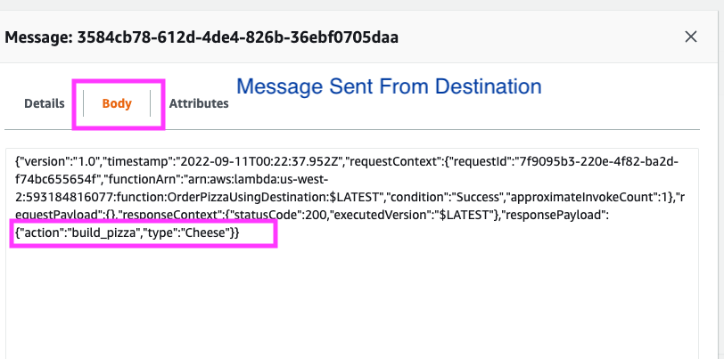

## Project Setup
This project is the CDK implementation of ['Extract Send Message'](../../patterns/extract_send_message.md) pattern.

It has 2 stacks:
- [lib/send-message-from-code.ts](lib/send-message-from-code.ts) This stack creates a lambda which publishes message to sqs directly from code
- [lib/send-message-from-destionation.ts](lib/send-message-from-code.ts) This stack creates a lambda where message sending is extracted from code and wired in CDK using  

## Project Usage

## Pre-Requisite

AWS CLI is configured with Administrator permission.

## Build

To build this app, you need to be in this example's root folder. Then run the following:

```bash
npm install -g aws-cdk
npm install
npm run build
```

This will install the necessary CDK, this example's dependencies, and then build your TypeScript files and your CloudFormation template.

## Deploy

Run below to deploy / redeploy this Stack to your AWS Account.
``` 
cdk deploy --all
```


## Testing it out

- First, lets invoke the lambda that sends message from code:
``` 
aws lambda invoke --function-name OrderPizza --invocation-type Event --payload '{}' output.json
```
You should see StatusCode:200

- Next, lets test the lambda which is refactored to uses Lambda Destination
 ``` 
aws lambda invoke --function-name OrderPizzaUsingDestination --invocation-type Event --payload '{}' output.json
``` 

You should see StatusCode:202     

*Note*: We used `--invocation-type Event`  above because Lambda Destination only supports Asynchronous invocation.


## Verify

Login to your AWS console and navigate to Amazon SQS.  
You should see 2 Queues.


Inspect the message on each Queue using 'Poll Messages'  



## Cleanup

To avoid unexpected charges to your account, make sure you terminate the resources created using CDK stacks.

```
cdk destroy --all
```

## To-DO 
 
Add Unit Test