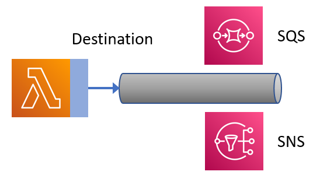

# Extract Send Message 



## Description

Sending a message to an SQS or an SNS channel directly from Lambda function code hides the application topology inside the function code = to understand the flow of messages one has to look inside the code.

## Solution

Use a [Lambda Destination ](https://aws.amazon.com/blogs/compute/introducing-aws-lambda-destinations/) to send the message and configure the channel name in CDK or CLoudFormation to make the application topology explicit.

You define a Lambda Destination inside a SAM Template through the [`EventInvokeConfig`](https://docs.aws.amazon.com/serverless-application-model/latest/developerguide/sam-property-function-eventinvokeconfiguration.html) element:

```
  MyFunction:
    Type: AWS::Serverless::Function
      EventInvokeConfig:
        DestinationConfig:
          OnSuccess:
            Type: SQS
            Destination: !GetAtt MyChannel.Arn
    ```

In CloudFormation, you specify a separate [`EventInvokeConfig`](https://docs.aws.amazon.com/AWSCloudFormation/latest/UserGuide/aws-resource-lambda-eventinvokeconfig.html) resource, which references both your function and the SQS/SNS channel:

```
  SendMessage:
    Type: AWS::Lambda::EventInvokeConfig
    Properties:
      FunctionName: !Ref MyFunction
      DestinationConfig:
        OnSuccess:
          Destination: !GetAtt MyChannel.Arn
```

In CDK, you either pass the destination on the Lamda Function constructor or add it later via the [`SqsDestination`](https://docs.aws.amazon.com/cdk/api/v2/docs/aws-cdk-lib.aws_lambda_destinations.SqsDestination.html) resource.

```
new lambda.Function(this, config.bankName, {
    runtime: lambda.Runtime.NODEJS_14_X,
    functionName: "MyFunction",
    onSuccess: new destinations.SqsDestination(sqsChannel),
```

## Considerations 

### Advvantages
* Extracting the message sending into a destination makes the application topology explicit and separates compsition from application logic

### Applicability
* Lambda Destinations are triggered only for *asynchronous* invocations. Therefore, this refactoring cannot be applied to synchronous invocations, e.g. from the console. If your functions returns a synchronous result, this is now replaced by the message to be sent
* Lambda Destinations are triggered at the end of the function execution whereas the code could send the message at any place. However, as the consumptionm of the SQS or SNS channel takes place asynchronously, this won't affect the overall flow.
* Destinations that invoke another Lambda function have the option to send the message body only, i.e. the data structure that your function returns (via the `responeOnly` option in [`LambdaDestinationOptions`](https://docs.aws.amazon.com/cdk/api/v2/docs/aws-cdk-lib.aws_lambda_destinations.LambdaDestinationOptions.html)). No such option exists for destinations that send messages to SQS or SNS. The message therefore includes the event wrapper and the actual data structure inside the `detail/responsePayload` element. This change will affect downstream event consumers. To maintain the same message format without the wrapper, you would need to direct the destination to an EventBridge, which filters the message content and then passes it onto the SQS chanel or SNS topic. An example of this is shown in the [Loan Broker CDK Example](https://github.com/spac3lord/eip/blob/master/LoanBroker/AwsStepFunctions/PubSub/LoanBrokerPubSub.yml)


## Related
