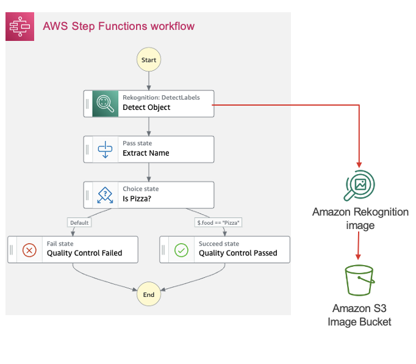

# Replace Lambda with Service Integration



## Description

Prior to the release of Set Functions' [Service Integration](https://docs.aws.amazon.com/step-functions/latest/dg/supported-services-awssdk.html), a separate Lambda function was needed to make a generic AWS SDK API call.  

An example might look as follows:

```
const aws = require('aws-sdk');
const rekognition = new aws.Rekognition();


exports.handler = async (event,context, callback) => {
    ...
    result = await rekognition.detectLabels(params).promise();
    ...
}
```

## Solution

Instead, use Step Functions direct SDK Service Integration to make an API call to any of over 200 AWS APIs.

```
arn:aws:states:::aws-sdk:serviceName:apiAction
```


## Considerations 

### Advantages
* You eliminate a run-time element and thus reduce cost and run-time complexity.
* You might lose the ability to decouple the API syntax from Step Functions, e.g. by setting defaults or post-processing results in the Lambda function

### Applicability

* Service Integration can invoke almost all AWS SDK APIs. See [the documentation](https://docs.aws.amazon.com/step-functions/latest/dg/supported-services-awssdk.html#unsupported-api-actions-list) for limitations 
* Cost: If you can replace the Lamda invocation with a single Step Functions state, the Step Functions cost remains and you save the Lambda execution cost. if you require an additional step, e.g. a pass state, standard workflows cost $0.025 per 1,000 state transitions, or roughly 1.5 Lambda GB-second. Express Workflow pricing matches Lambda pricing per GB-sec \[validate\]

## Related Refactorings
* Direct database access

